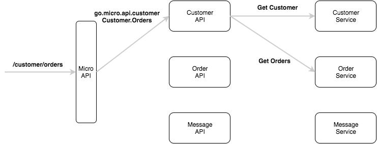
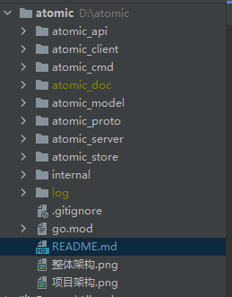

# atomic
## my blog

## 项目介绍
该项目采用了微服务的模式,用了go-micro作为内部服务的框架,gin作为http api的框架,jaeger以及opentracing
作为链路追踪,mysql作为数据库,etcd作为注册中心。
### 整体架构

### 项目架构

#### atomic_api
该文件夹主要是存放对外开放的api,主要是通过gin实现,通过micro api网关请求,转发到该api服务,然后api转发到相应的内部服务
#### atomic_cmd
该文件夹主要是存放命令行操作以及启动服务的代码
#### atomic_client
该文件夹主要是测试服务能否被发现
#### atomic_proto
该文件夹主要是存放proto相关的文件
#### atomic_server
存放具体的业务逻辑代码,handler的实现,数据库操作都放在这里面
#### atomic_store
存放各种数据库的封装
#### internal
存放各种内部的一些操作 比如日志、链路追踪等等